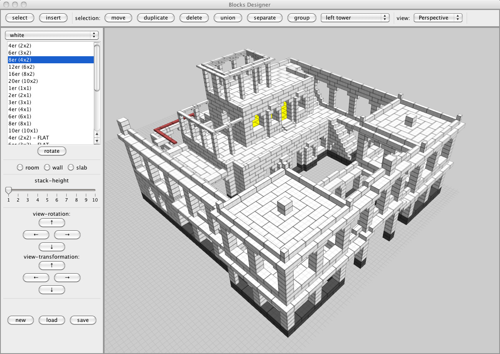

# BlockDesigner (2010)

BlockDesigner is a 3D modeling tool designed for creating structures with
interlocking blocks (brick-building systems).

> **Note**
> This repository is a historical archive of the original 2010 codebase. It is
> preserved here for educational and reference purposes and is no longer
> actively maintained.

- **Original Release:** 2010
- **Language:** Java
- **Author:** Andreas Schwenk
- **License:** MIT



### Why "Blocks"?

The project uses the generic term "Blocks" to describe the 3D assets to avoid
trademark issues with specific toy brands.

### Modernized Build System (2025 Update)

For easier integration with modern development environments, a `pom.xml` file was provided in 2025. This allows the project to be managed as a standard Maven project, automating dependency resolution and the build lifecycle.

### Technologies

- Java: Originally developed for JDK 6 (2010); now compatible with modern Maven-based workflows.
- 3D Rendering: The application utilizes JOGL (Java Binding for OpenGL) for high-performance 3D hardware acceleration. JOGL remains the primary library for accessing the OpenGL API within the Java ecosystem.

### Run the Project

To build and run the project using the 2025 Maven configuration, ensure you have Maven 3.9+ installed and run:

```bash
mvn exec:java
```

## Running in VSCode

For an integrated development experience, you can run and debug this project directly within VSCode:

- Install Extensions: Install the Extension Pack for Java (which includes Language Support for Java™ by Red Hat and Maven for Java).
- Open Project: Open the root folder (the one containing pom.xml) in VSCode.
- Project Import: Wait for the "Java Language Server" to finish importing your Maven dependencies (visible in the status bar).
- Run/Debug: Press [F5] to start debugging or [Ctrl+F5] to run without debugging.

Note: The project is configured via launch.json to automatically include the necessary JVM modularity flags (`--add-opens`) required for JOGL on modern JDKs (17/21+).
